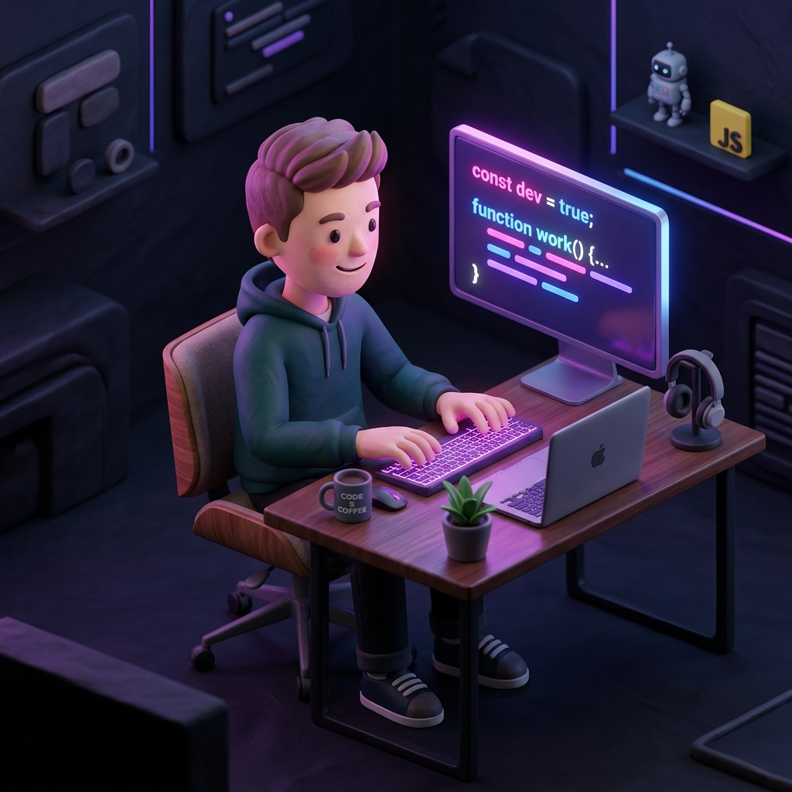

# 🌌 Premium Next.js Developer Portfolio — Ashish Kumar

<div align="center">
  
  
  <h3>Ashish Kumar — AI Engineer & Fullstack Systems Architect</h3>
  <p>A high-fidelity, component-driven interactive portfolio engineered with Next.js, React, Tailwind CSS, GSAP, and Lenis smooth-scrolling.</p>
</div>

---

## ✨ Features & Technologies

This portfolio is crafted for optimal client-side rendering speed and elegant interactive micro-animations:

- **⚛️ Core Tech**: React & Next.js App Router for dynamic routing and high-performance loading.
- **🌀 Smooth Scrolling**: Lenis scroll physics bound with GSAP scroll triggers for rich, tactile viewport animations.
- **🎨 Modern UI**: Vibrant HSL colors, responsive grids, and standard glassmorphic containers.
- **📈 Resilient API Architecture**: Try-catch wrappers handling real-time asynchronous data requests.

---

## 🛠 Setup & Local Development

First, navigate into the project directory and install the dependencies:

```bash
npm install --legacy-peer-deps
```

Then, spin up the local Next.js development server:

```bash
npm run dev
```

Your site will be served live at:
👉 **https://project-7kt5w.vercel.app**
